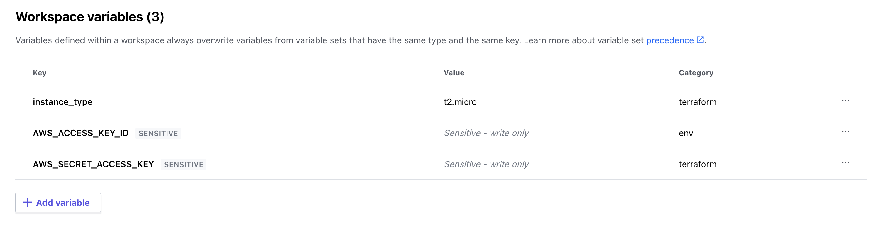

# Table of Contents

- [Introduction to Terraform](#introduction-to-terraform)
- [Setup VS Code](#setup-vs-code)
- [Basic Terraform Commands](#basic-terraform-commands)
- [Terraform state file](#terraform-state-file)
- [Terraform Cloud workspaces](#terraform-cloud-workspaces)
- [Terraform attributes as blocks](#terraform-attributes-as-blocks)
- [Examples](#examples)
- [Projects TO-DO](#projects-to-do)

## Introduction to Terraform

Terraform is a tool for building, deploying, and managing infrastructure as code. It uses HCL (HashiCorp's Configuration Language) to describe the infrastructure to build.

Although it is primarily used for provisioning/managing infrastructure in public cloud, but you can use it to manage almost any resource which has an API to expose to Terraform. i.e. you can use terraform to create/manage a website resource like products as well i.e. if you have an API which creates/updates/deletes a product, you can write your own terraform provider to manage that product.

## Setup VS Code

Install the extensions listed below to get started with Terraform.

<ol>
  <li>Terraform autocomplete</li>
  <li>Hashicorp Terraform</li>
</ol>

## Basic Terraform Commands

- Command to run initialize project: `terraform init`
- Command to check what changes terraform will make: `terraform plan`
  - This will show you what changes will be made to your infrastructure
  - This will create a state file which terraform uses to keep track of your infrastructure
  - We can use -out to save the plan to a file
- Command to apply changes: `terraform apply`
  - If you want to execute a saved plan, use terraform apply "plan.tfplan"
- Command to refresh your state file: `terraform refresh`
  - This will refresh your state file with the latest changes
  - It does not remove anything but adds additional information from infrastructure
- Command to print outputs of your infrastructure: `terraform output`
- Command to destroy your infrastructure: `terraform destroy`

## Terraform state file

- The state file is a json file that contains all of the information about your infrastructure
- this file is named as terraform.tfstate
- The state file is saved in the root of your project

## Terraform Cloud Workspaces

- Terraform cloud allows you to manage your work in a workspace.
- This workspace can be configured to run terraform apply in terraform cloud infrastructure or terraform apply in a local environment.
- When you select a workspace to use local environment, your variable references will be resolved locally.
- But if you select a workspace to run terraform apply in terraform cloud, your variable references will be resolved in the workspace.
- So, if you want to use terraform infrastructure to run your code, you need to create variables in the workspace.
- when you are using terraform infrastructure, you also need to provide your AWS ACCESS KEY and SECRET KEY as environment variables.

  - 

## Terraform Attributes as blocks

Terraform has an interesting aspect about how it traverses attributes within a resource. Lets look at below code for a behavior which was hard to figure out for me in the beginning.

`Snippet-1`: This snippet uses a regular attribute declaration method but the thing to notice is the requirement to declare multiple ingress rules/attribute. Declaring attributes in terraform this way allows us to avoid the optional values needed by the resource i.e. fields like `description` can be ignored in this example.

```
ingress = {
      description = "SSH access"
      from_port   = 22
      to_port     = 22
      protocol    = "tcp"
      cidr_blocks = ["0.0.0.0/0"]
    }

ingress = {
      description = "HTTP access"
      from_port   = 80
      to_port     = 80
      protocol    = "tcp"
      cidr_blocks = ["0.0.0.0/0"]
    }
```

`Snippet-2`: This snippet uses a collection i.e. a list of similar attributes. So, rather than declaring multiple resource attributes one by one as shown in Snippet-1, we can specify them as list and this is the recommended way. But the caveat here is, if we use a list to define these attributes, we will have to specify the values for optional fields as well. If we do not do this, then we can get an error like:

`ERROR`: <p>Inappropriate value for attribute "ingress": element 0: attributes "ipv6_cidr_blocks", "prefix_list_ids", "security_groups", and "self" are required.</p>

```
ingress = [
    {
      description = "SSH access"
      from_port   = 22
      to_port     = 22
      protocol    = "tcp"
      cidr_blocks = ["0.0.0.0/0"]
    },
    {
      description = "HTTP access"
      from_port   = 80
      to_port     = 80
      protocol    = "tcp"
      cidr_blocks = ["0.0.0.0/0"]
    }
  ]
```

`Note`: If you want to read more, [Click here](https://www.terraform.io/language/attr-as-blocks)

## Examples

- [First resource](first-resource/main.tf)
- [AWS EC2](aws-ec2/main.tf)
- [Variables](variables/main.tf)
- [Cloud Init](cloud-init/main.tf)
- Provisioners:
  - [local-exec](local-exec/README.md)
  - [remote-exec](remote-exec/README.md)
  - [null resource](null-resource/README.md)
- [remote-backend](remote-backend/main.tf)

## Projects to do

- Manage an ECE installation using Terraform and ansible in AWS
- Create Elasticsearch clusters in ECE using terraform provider.
- Create a custom terraform provider.
